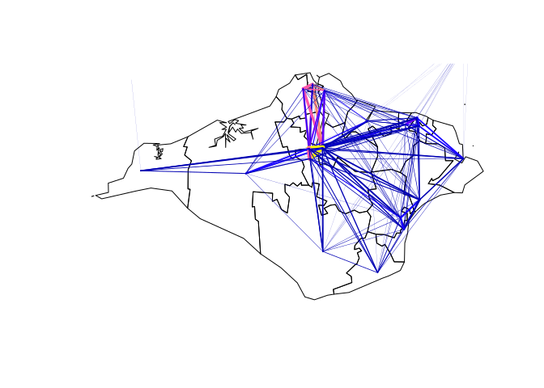
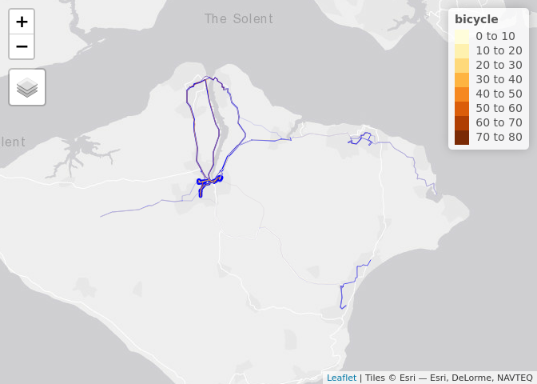

Advanced Propensity to Cycle Tool training: write-up, materials, and
next workshop
================

# Introduction

The first of two Propensity to Cycle Tool (PCT) Advanced Training
Workshops took place last week in London. This post provides an outline
of the contents of the workshop, plus links, ideas and sample code for
people interested in using or extending the PCT, who were unable to make
the event in person. The course was delivered by me (Robin, Lead
Developer of the PCT) and my colleague Malcolm Morgan (who led on some
of the big data processing and raster tile generation elements of the
project). Warning: both of us are heavy R users, so the materials
contained plenty of code (more on that soon)\!

The overall aim was to get people up-to-speed with the methods and
technologies underlying the PCT, to support wider processes of designing
for ‘bikeway networks’ (Buehler and Dill 2016), as part of a wider
process of planning for cycle traffic and people, rather than cars
(Parkin 2018). The introductory and intermediate training courses used
the online interface and the excellent
[QGIS](https://itsleeds.github.io/QGIS-intro/) as the basis for
analysing cycle potential. This workshop, however, focussed on working
with transport data in R, an open source statistical programming
language that can be downloaded from
[cran.r-project.org](https://cran.r-project.org/) and used by anyone for
free. The emphasis on doing interactive data analysis and programming in
RStudio, a free and open source high performance integrated development
environment (IDE) for R that can be downloaded from
[rstudio.com](https://www.rstudio.com/products/rstudio/download/).

This ‘command line’ approach allows reproducibility, automation and,
once you have overcome R’s steep learning curve, high productivity.
Another reason for teaching the Advanced Workshop in R, is that it opens
the possibility of extending the PCT, something envisaged in the
original PCT paper (Lovelace et al. 2017):

> The PCT’s open source license allows others to modify it for their own
> needs. We encourage practitioners to ‘fork’ the project … and display
> of the results to suit local contexts. This could, for example, help
> to visualise city-level targets for the proportion cycling by a
> certain year and which will vary considerably from place to place in
> ways not yet well understood. Modifying the code base would also allow
> transport planners to decide on and create the precise set of online
> tools that are most useful for their work.

# The PCT R package

An important aspect of the PCT, which we advocate others developing
publicly funding transport modelling tools to adopt, is that it is open
source and based on open data, ensuring transparency, reproducibility,
and preventing monopolisation by single companies and ‘cloud lock-in’.
These are vital if transport modelling is to be a fully fledged part of
an open and democratically accountable transport planning system, that
is part of the democratic process.

‘Open source’ means you can see the PCT’s codebase, which is hosted at
[github.com/npct](https://github.com/npct/). Rather than use this
codebase, which was developed using R packages such as **sp** that are
now slightly out of date, we taught the course based on data that could
be downloaded in the **sf** class system (if that sounds like double
Dutch to you, see an explanation
[here](https://geocompr.robinlovelace.net/spatial-class.html#intro-sf)).
Data was provided by **pct**, a small R package that was written to
enable ease of access to data and methods underlying the PCT from R’s
command line interface. For more on the package, the latest version of
which has just been [released on
CRAN](https://cran.r-project.org/package=pct), see it’s online home at
[itsleeds.github.io/pct](https://itsleeds.github.io/pct/).

In terms of learning objectives, the aim was for participants able to be
able to do the following things, with help from the **pct** R package:

  - Understand the data and code underlying the PCT
  - Download data from the PCT at various geographic levels
  - Use R as a tool for transport data analysis and cycle network
    planning

The workshop was divided into two halves. Before lunch, we provided an
overview of the PCT project with a focus on the different types of data
used in the PCT and some of the strengths, limitations and opportunities
of the national PCT data, with reference to an academic paper that
provides an overview of the approach Lovelace et al. (2017). After lunch
we progressed to a ‘minihack’ during which participants were provided with an opportunity to apply the methods to their own data.

## Datasets processed

In terms of the input data, the concept of a ‘data hierarchy’ was used
to introduce the various geographic levels of the data used in the PCT,
with reference to Chapter 6 (Transportation) of the open source and
publicly available book, *Geocomputation with R* (Lovelace, Nowosad, and
Meunchow 2019). At the base of the pyramid is zonal data, which is
widely available yet highly aggregated. In the PCT, zones represent, on
average, around 6000 people (around half of whom commute) at the Middle
Super Output Area (MSOA) level, and around 1200 people at the Lower
Super Output Area (LSOA) level. The key data level used by the PCT,
however, is origin-destination data, which forms the basis of the route
and route network levels. These datasets are generated using the
following processes:

  - Origin-destination (OD) data processed using functions such as
    `od2line()` in the **stplanr** R package (Lovelace and Ellison 2018)
  - Route network generation and analysis
  - Route allocation using different routing services
  - Geographic desire lines

These stages were illustrated in the Isle of Wight, a relatively small
and self-contained region that is ideal for testing. The starting code
to analyse car-dependent routes on the island was as follows:

``` r
library(sf)
library(pct)
library(dplyr) # suggestion: use library(tidyverse)
z_original = get_pct_zones("isle-of-wight")
z = z_original %>% 
  select(geo_code, geo_name, all, bicycle, car_driver)
l = get_pct_lines("isle-of-wight")
plot(z$geometry)
lwd = l$all / mean(l$all)
plot(l["bicycle"], lwd = lwd, add = TRUE)
```

<!-- -->

We rapidly progressed through the course, to analyse cycling potential
at route and route network levels, using a small input dataset
representing 30 key desire lines on the Isle of Wight. Exercise for the
reader: see if you can run the code chunk below (after running the
previous chunk), to generate this plot:

``` r
library(tmap)
library(stplanr)
tmap_mode("view")
route_data = st_sf(st_drop_geometry(wight_lines_30), geometry = wight_routes_30$geometry)
rnet = overline2(route_data, "dutch_slc")
tm_shape(rnet) +
  tm_lines(lwd = "dutch_slc", col = "blue", scale = 7) +
  tm_shape(route_data) +
  tm_lines(col = "bicycle", lwd = "all")
```

<!-- -->

# Next steps

Rather than explain what is going on here, this post (nearly) finishes
by guiding readers towards further resources on the study of cycling
potential at the command line:

  - Paper on the **stplanr** paper for transport planning (available
    [online](https://cran.r-project.org/web/packages/stplanr/vignettes/stplanr-paper.html))
    (Lovelace and Ellison 2018)
  - Introductory and advanced content on geographic data in R,
    especially the [transport
    chapter](http://geocompr.robinlovelace.net/transport.html)
    (available free [online](http://geocompr.robinlovelace.net/))
    (Lovelace, Nowosad, and Meunchow 2019)
  - Paper on analysing OSM data in Python (Boeing 2017) (available
    [online](https://arxiv.org/pdf/1611.01890))

The final thing to say is that there is another PCT Advanced Workshop
upcoming, this time in Leeds, on the 2<sup>nd</sup> August. If you would
like to attend, please check out the course
[prerequisites](https://itsleeds.github.io/pct/articles/pct_training.html#prerequisites)
and, if you think it’s right for you, email me at R. Lovelace at Leeds.
ac. uk (address in the cryptic form to discourage spam)\!

# References

<div id="refs" class="references">

<div id="ref-boeing_osmnx:_2017">

Boeing, Geoff. 2017. “OSMnx: New Methods for Acquiring, Constructing,
Analyzing, and Visualizing Complex Street Networks.” *Computers,
Environment and Urban Systems* 65 (September): 126–39.
<https://doi.org/10.1016/j.compenvurbsys.2017.05.004>.

</div>

<div id="ref-buehler_bikeway_2016">

Buehler, Ralph, and Jennifer Dill. 2016. “Bikeway Networks: A Review of
Effects on Cycling.” *Transport Reviews* 36 (1): 9–27.
<https://doi.org/10.1080/01441647.2015.1069908>.

</div>

<div id="ref-lovelace_stplanr:_2018">

Lovelace, Robin, and Richard Ellison. 2018. “Stplanr: A Package for
Transport Planning.” *The R Journal* 10 (2): 7–23.
<https://doi.org/10.32614/RJ-2018-053>.

</div>

<div id="ref-lovelace_propensity_2017">

Lovelace, Robin, Anna Goodman, Rachel Aldred, Nikolai Berkoff, Ali
Abbas, and James Woodcock. 2017. “The Propensity to Cycle Tool: An Open
Source Online System for Sustainable Transport Planning.” *Journal of
Transport and Land Use* 10 (1). <https://doi.org/10.5198/jtlu.2016.862>.

</div>

<div id="ref-lovelace_geocomputation_2019">

Lovelace, Robin, Jakub Nowosad, and Jannes Meunchow. 2019.
*Geocomputation with R*. CRC Press. <http://robinlovelace.net/geocompr>.

</div>

<div id="ref-parkin_designing_2018">

Parkin, John. 2018. *Designing for Cycle Traffic: International
Principles and Practice*. ICE Publishing.
<https://www.icevirtuallibrary.com/isbn/9780727763495>.

</div>

</div>
